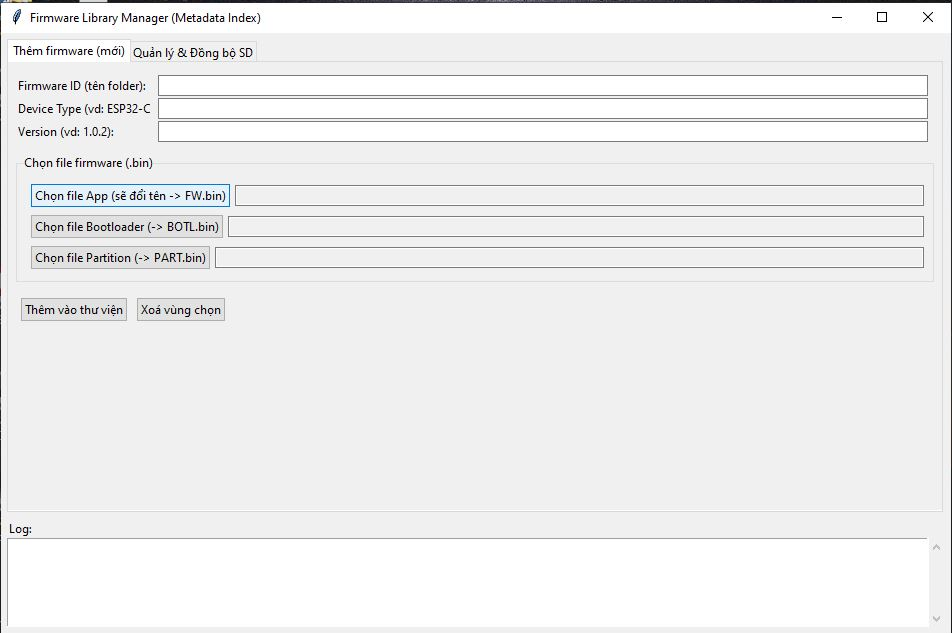

# 🚀 ESP32 Offline Flasher

**ESP32 Offline Flasher** biến một bo **ESP32 (Host)** thành một thiết bị **nạp firmware di động**, **không cần máy tính**.  
Bạn có thể chọn firmware từ **menu OLED** và nạp cho một **ESP32 khác (Target)** qua UART.

---

## 🌟 Tính năng

Dự án này là một giải pháp hoàn chỉnh để cập nhật firmware **“tại chỗ” (in-the-field):**

- 📱 **Menu OLED:** Giao diện menu tương tác trên màn hình SSD1306 (128x32).
- 🗃️ **Nạp từ Thẻ SD:** Đọc danh sách firmware động từ file `index.txt` (định dạng JSON) trên thẻ SD.
- ⚡ **Flash Nhanh:** Sử dụng thư viện `espressif/esp-serial-flasher` để nạp cho ESP32 Target qua UART tốc độ cao.
- 🕹️ **Điều khiển 3 nút:** Dễ dàng điều hướng menu với các nút **UP**, **DOWN**, và **OK** (có debounce).
- 🔍 **Xác thực MD5 (Tùy chọn):** Kiểm tra tính toàn vẹn firmware sau khi nạp nếu có thông tin MD5 trong `index.txt`.
- 📊 **Phản hồi Trực quan:** Hiển thị trạng thái (Booting, Flashing, Progress, Success, Error) trên OLED.
- 📡 **UART Monitor:** Tự động tạo task để lắng nghe và in log từ Target sau khi nạp xong.

---

## 🛠️ Phần cứng Yêu cầu

### 1️⃣ Host (Thiết bị Nạp)

Thiết bị chạy code này:

- **Vi điều khiển:** ESP32 (thiết kế cho ESP32-C3 hoặc S3)
- **Màn hình OLED:** SSD1306 I2C (128x32)  
  - SDA → *(I2C SDA)*  
  - SCL → *(I2C SCL)*
- **Lưu trữ:** Thẻ MicroSD qua SPI  
  - CS → GPIO 7  
  - MOSI, MISO, SCK → *(SPI Pins)*
- **Điều khiển:** 3 nút nhấn (kéo lên VCC, nhấn xuống GND)  
  - BTN_UP → GPIO 21  
  - BTN_DOWN → GPIO 20  
  - BTN_OK → GPIO 10

### 2️⃣ Target (Thiết bị được Nạp)

ESP32 cần nạp firmware.

### 3️⃣ Kết nối Host ↔ Target

| Host (Nạp) | Target (Được Nạp) | Chức năng              |
|-------------|--------------------|-------------------------|
| GPIO 0 (UART1_TX) | RXD0 | Gửi dữ liệu firmware |
| GPIO 1 (UART1_RX) | TXD0 | Nhận phản hồi / log |
| GPIO 2 | EN / RESET | Reset Target |
| GPIO 3 | GPIO0 / BOOT | Đưa vào chế độ nạp |

---

## ⚙️ Cách Hoạt động

1. **Khởi động:** ESP32 khởi động OLED và mount thẻ SD.  
2. **Đọc Metadata:** Mở file `/index.txt` trên thẻ SD.  
3. **Xây dựng Menu:** Phân tích JSON, tạo danh sách firmware (thêm mục *Exit* tự động).  
4. **Hiển thị Menu:** Cho phép người dùng cuộn và chọn firmware.  
5. **Chọn Firmware:** Khi nhấn OK, hệ thống lấy thông tin firmware tương ứng (đường dẫn, MD5, ...).  
6. **Vào Chế độ Nạp:** Điều khiển EN và BOOT của Target để kích hoạt Bootloader.  
7. **Nạp Firmware:** Đọc từng phần `.bin` từ thẻ SD và ghi vào Target qua UART, hiển thị tiến trình trên OLED.  
8. **Xác thực (tùy chọn):** Nếu có MD5, hệ thống xác thực dữ liệu sau khi nạp.  
9. **Hoàn tất:** Target được reset, chạy firmware mới. Hiển thị “✅ Success” và bắt đầu **task UART monitor** để xem log.

---

## 💻 FlashPorter: Trợ thủ Đắc lực (PC Tool)

Không cần chỉnh file JSON thủ công dễ sai sót!  
Dự án đi kèm **tool FlashPorter** giúp bạn chuẩn bị thẻ SD **chỉ trong vài cú click**.

### ⚡ Chức năng của FlashPorter:

- 📁 **Quản lý Thư viện:** Tổ chức các phiên bản firmware gọn gàng (Bootloader, Partition, App).  
- 🔐 **Tự động MD5:** Tính toán hash MD5 đảm bảo nạp an toàn.  
- 💾 **Xuất ra Thẻ SD:** Tạo cấu trúc thư mục chuẩn và file `index.txt` tự động.

### 🧠 Cách dùng:

1. Mở **FlashPorter.exe** trên máy tính.  
2. Nhập thông tin phiên bản (Ví dụ: `ESP32-S3_V1.0`).  
3. Chọn các file `.bin` tương ứng (Bootloader, Partition, Firmware).  
4. Nhấn **Export to SD Card** và chọn ổ đĩa thẻ nhớ của bạn.  
   → Tool sẽ tự động tạo cấu trúc và file `index.txt`.

  

### 📂 Cấu trúc Thẻ SD (Sau khi dùng FlashPorter)

SD_ROOT/
  - index.txt  ← File quản lý chính (tự động tạo)
  - FW_S3_V1/
      - bootloader.bin
      - partitions.bin
      - app.bin
  - FW_C3_V2/
      - bootloader.bin
      - partitions.bin
      - app.bin

