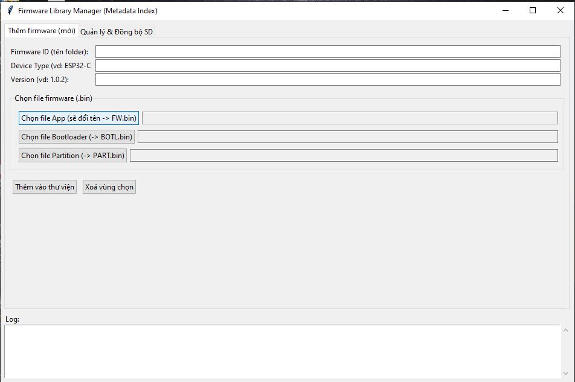
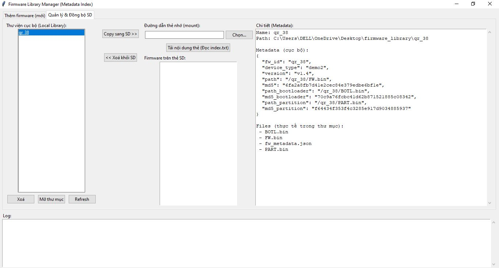

# 🚀 ESP32 Multi-Flasher

**ESP32 Multi-Flasher** biến một bo **ESP32 (Host)** thành một thiết bị **nạp firmware di động**, **không cần máy tính**.
Hỗ trợ hai chế độ hoạt động: **Offline (từ thẻ SD)** và **Online (đồng bộ qua WiFi)**.

---

## 🌟 Tính năng

### 📱 Chế độ Offline (SD Card)
- **Menu OLED:** Giao diện menu tương tác trên màn hình SSD1306 (128x32)
- **Nạp từ Thẻ SD:** Đọc danh sách firmware động từ file `index.txt` (định dạng JSON)
- **Flash Nhanh:** Sử dụng thư viện `espressif/esp-serial-flasher` để nạp qua UART tốc độ cao
- **Xác thực MD5:** Kiểm tra tính toàn vẹn firmware sau khi nạp (tùy chọn)
- **Điều khiển 3 nút:** UP, DOWN, OK với debounce để điều hướng menu
- **Monitor UART:** Xem log từ Target sau khi nạp xong
- **Chip Erase:** Xóa toàn bộ flash của Target

### 🌐 Chế độ Online (WiFi Sync)
- **Auto-Sync:** Tải firmware từ GitHub/remote server qua WiFi
- **Mã hóa AES-128-CBC:** Tải file mã hóa `.enc` và giải mã tự động
- **Đồng bộ thông minh:** So sánh index local vs remote, chỉ tải file thay đổi
- **WiFi Portal:** Cấu hình WiFi và server URL qua captive portal (WiFiManager)
- **Force Clean:** Nhấn giữ 3s để xóa tất cả firmware local và đồng bộ lại

### 🎮 Phản hồi Trực quan
- Hiển thị trạng thái (Booting, Flashing, Progress %, Success, Error) trên OLED
- Log chi tiết qua UART Serial (115200 baud)
- Tự động khởi động lại sau mỗi thao tác để giải phóng RAM

---

## 🛠️ Phần cứng Yêu cầu

### 1️⃣ Host (Thiết bị Nạp)

**Vi điều khiển:** ESP32-C3 (primary target, có thể dùng ESP32-S3)
**Framework:** ESP-IDF v5.1.6 + Arduino component

#### Kết nối phần cứng:

| Thiết bị | Chân GPIO | Ghi chú |
|----------|-----------|---------|
| **OLED SSD1306** | SDA → GPIO 8 | I2C Address: 0x3C |
|  | SCL → GPIO 9 | 128x32 pixels |
| **Thẻ SD** | CS → GPIO 7 | SPI mode, FAT filesystem |
| **Nút UP** | GPIO 21 | Pull-up, nhấn → GND |
| **Nút DOWN** | GPIO 20 | Pull-up, nhấn → GND |
| **Nút OK** | GPIO 10 | Pull-up, nhấn → GND |

### 2️⃣ Target (Thiết bị được Nạp)

ESP32 bất kỳ cần nạp firmware.

### 3️⃣ Kết nối Host ↔ Target

| Host GPIO | Target Pin | Chức năng |
|-----------|------------|-----------|
| GPIO 0 (TX) | RXD0 | Gửi dữ liệu firmware |
| GPIO 1 (RX) | TXD0 | Nhận phản hồi/log |
| GPIO 2 | EN/RESET | Reset Target |
| GPIO 3 | GPIO0/BOOT | Đưa vào chế độ nạp |

---

## ⚙️ Cách Hoạt động

### Offline Mode (Nạp từ SD)
1. **Khởi động:** ESP32 khởi động OLED và mount thẻ SD
2. **Đọc Metadata:** Mở file `/index.txt` trên thẻ SD (JSON format)
3. **Xây dựng Menu:** Hiển thị danh sách firmware + lệnh hệ thống (Monitor, Sync, Erase, Exit)
4. **Chọn Firmware:** Cuộn bằng UP/DOWN, nhấn OK để chọn
5. **Vào Chế độ Nạp:** Điều khiển EN và BOOT của Target
6. **Nạp Firmware:** Ghi bootloader (0x1000), partition (0x8000), app (0x10000) vào Target
7. **Xác thực:** Kiểm tra MD5 nếu có trong metadata
8. **Hoàn tất:** Reset Target, hiển thị "✅ Success", khởi động lại Host

### Online Mode (Đồng bộ WiFi)
1. **Chọn "Sync":** Từ menu chính
2. **Xác nhận:** UP=Chạy, DOWN=Cấu hình WiFi, OK=Hủy
3. **Kết nối WiFi:** Tự động hoặc qua captive portal
4. **Tải Index:** Download `/index.txt` từ remote server
5. **So sánh:** Kiểm tra version/MD5 với file local
6. **Tải Firmware:** Download file `.enc` mới, giải mã AES-128-CBC, lưu vào SD
7. **Cập nhật:** Ghi đè `/index.txt` local
8. **Hoàn tất:** Ngắt WiFi, khởi động lại

---

## 💻 FlashPorter: Trợ thủ Đắc lực (PC Tool)

Không cần chỉnh file JSON thủ công!
Tool **FlashPorter** giúp chuẩn bị thẻ SD **chỉ trong vài cú click**.

### ⚡ Chức năng:
- 📁 Quản lý thư viện firmware (Bootloader, Partition, App)
- 🔐 Tự động tính MD5 hash
- 💾 Xuất ra thẻ SD với cấu trúc chuẩn và file `index.txt`

### 🧠 Cách dùng:
1. Mở **FlashPorter.exe**
2. Nhập tên firmware (VD: `ESP32-C3_V1.0`)
3. Chọn file `.bin` (Bootloader, Partition, App)
4. Nhấn **Export to SD Card** → Chọn ổ đĩa thẻ nhớ
5. Tool tự động tạo cấu trúc và file `index.txt`

---

<p align="center">
  
  
</p>

## 📂 Cấu trúc Thẻ SD

```
SD_ROOT/
├── index.txt              # File quản lý chính (JSON)
├── config/                # Cấu hình WiFi Sync (tùy chọn)
│   ├── url.txt           # URL remote server
│   ├── aes_key.txt       # AES key (16 bytes)
│   └── aes_iv.txt        # AES IV (16 bytes)
├── FW_C3_V1/             # Thư mục firmware 1 (8.3 format)
│   ├── boot.bin          # Bootloader
│   ├── part.bin          # Partition table
│   └── app.bin           # Application
└── FW_S3_V2/             # Thư mục firmware 2
    ├── boot.bin
    ├── part.bin
    └── app.bin
```

**⚠️ Lưu ý:** Tên thư mục/file phải tuân thủ **8.3 format** (FAT filesystem):
- Tên folder: tối đa 8 ký tự
- Tên file: tối đa 8 ký tự + 3 ký tự đuôi (.bin, .txt, .enc)

### Ví dụ file `index.txt`:

```json
{
  "FW_C3_V1": {
    "device_type": "ESP32-C3",
    "version": "1.0.0",
    "path": "/FW_C3_V1/app.bin",
    "md5": "abc123...",
    "path_bootloader": "/FW_C3_V1/boot.bin",
    "md5_bootloader": "def456...",
    "path_partition": "/FW_C3_V1/part.bin",
    "md5_partition": "789ghi..."
  },
  "FW_S3_V2": {
    "device_type": "ESP32-S3",
    "version": "2.0.1",
    "path": "/FW_S3_V2/app.bin",
    "md5": "xyz789...",
    "path_bootloader": "/FW_S3_V2/boot.bin",
    "md5_bootloader": "uvw012...",
    "path_partition": "/FW_S3_V2/part.bin",
    "md5_partition": "rst345..."
  }
}
```

---

## 🔧 Build và Flash

### Yêu cầu:
- ESP-IDF v5.1.6 trở lên
- Python 3.8+
- CMake, Ninja

### Các bước:

```bash
# 1. Clone repository
git clone https://github.com/YOUR_REPO/ESP32_MultiFlasher.git
cd ESP32_MultiFlasher

# 2. Cấu hình IDF environment
. $IDF_PATH/export.sh

# 3. Set target (ESP32-C3)
idf.py set-target esp32c3

# 4. Build
idf.py build

# 5. Flash vào ESP32 Host
idf.py -p COM3 flash monitor  # Windows
# hoặc
idf.py -p /dev/ttyUSB0 flash monitor  # Linux/Mac
```

### Địa chỉ nạp (cho Host):
- Bootloader: `0x0`
- Partition: `0x8000`
- App: `0x10000`

---

## 🎯 Sử dụng

### Khởi động lần đầu:
1. Chuẩn bị thẻ SD bằng **FlashPorter** (`toolAddFirmware/dist/FlashPorter.exe`)
2. Lắp thẻ SD vào Host ESP32
3. Kết nối OLED, buttons theo sơ đồ
4. Cấp nguồn → OLED hiển thị "Booting..."
5. Menu hiển thị danh sách firmware

### FlashPorter Tool (PC):
Tool Python/Tkinter để chuẩn bị thẻ SD:
```bash
cd toolAddFirmware
pip install pycryptodome
python FlashPorter.py
# Hoặc chạy trực tiếp: dist/FlashPorter.exe (Windows)
```
**Tính năng:**
- Thêm firmware mới (FW.bin, BOTL.bin, PART.bin)
- Copy ra thẻ SD (với PKCS7 padding)
- Mã hóa AES-128-CBC và push lên GitHub

### Nạp Firmware:
1. Cuộn bằng UP/DOWN để chọn firmware
2. Nhấn OK
3. Đợi "Flashing..." → "Done!"
4. Hệ thống tự động restart

### Đồng bộ WiFi:
1. Chọn "Sync" từ menu
2. Nhấn UP để xác nhận (hoặc DOWN để cấu hình WiFi)
3. Đợi kết nối WiFi
4. Đợi tải và giải mã firmware
5. Hệ thống restart, menu cập nhật

### Monitor Target:
1. Chọn "Monitor" từ menu
2. Xem log qua UART (hiển thị trên PC serial monitor)
3. Nhấn OK để thoát

### Chip Erase:
1. Chọn "Erase" từ menu
2. Đợi "Erasing..." → "SUCCESS!"

---

## 📚 Tài liệu kỹ thuật

Xem thêm trong thư mục `docs/`:
- **project-overview-pdr.md** - Yêu cầu sản phẩm chi tiết
- **codebase-summary.md** - Tóm tắt cấu trúc code
- **code-standards.md** - Quy chuẩn lập trình
- **system-architecture.md** - Kiến trúc hệ thống
- **project-roadmap.md** - Lộ trình phát triển

---

## 🔌 Thư viện Dependencies

**ESP-IDF Components:**
- `espressif/esp-serial-flasher` - Low-level UART flash protocol
- `espressif/arduino-esp32` - Arduino framework
- `bblanchon/ArduinoJson` - JSON parsing
- `mbedtls` - AES encryption

**Arduino Libraries (via component):**
- `Adafruit_SSD1306` - OLED display driver
- `Adafruit_GFX` - Graphics library
- `WiFiManager` - WiFi configuration portal

---

## 📊 Giới hạn kỹ thuật

- **RAM:** Hệ thống restart sau mỗi thao tác để giải phóng bộ nhớ
- **SD Card:** Chỉ hỗ trợ FAT filesystem (8.3 filename format)
- **WiFi:** Chỉ hỗ trợ 2.4GHz (không hỗ trợ 5GHz)
- **AES Key/IV:** Phải đúng 16 bytes
- **Firmware size:** Giới hạn bởi dung lượng thẻ SD và tốc độ download

---

## 🐛 Troubleshooting

**OLED không hiển thị:**
- Kiểm tra kết nối I2C (SDA/SCL)
- Xác nhận địa chỉ I2C là 0x3C
- Kiểm tra nguồn 3.3V

**Thẻ SD mount thất bại:**
- Kiểm tra định dạng FAT32
- Thử thẻ SD khác (Class 10 trở lên)
- Kiểm tra kết nối SPI

**Nạp firmware thất bại:**
- Kiểm tra kết nối UART Host-Target
- Xác nhận Target ở chế độ flash (GPIO0 pulled down)
- Kiểm tra file .bin không bị lỗi

**WiFi không kết nối:**
- Đảm bảo mạng 2.4GHz (không phải 5GHz)
- Thử reset WiFi config (nút DOWN khi chọn Sync)
- Kiểm tra file `/config/url.txt`

---

## 🤝 Đóng góp

Fork → Branch → Commit → Pull Request

---

**MIT License** | **TTP27** (2025) | **v1.0.0** (27/11/2025)
